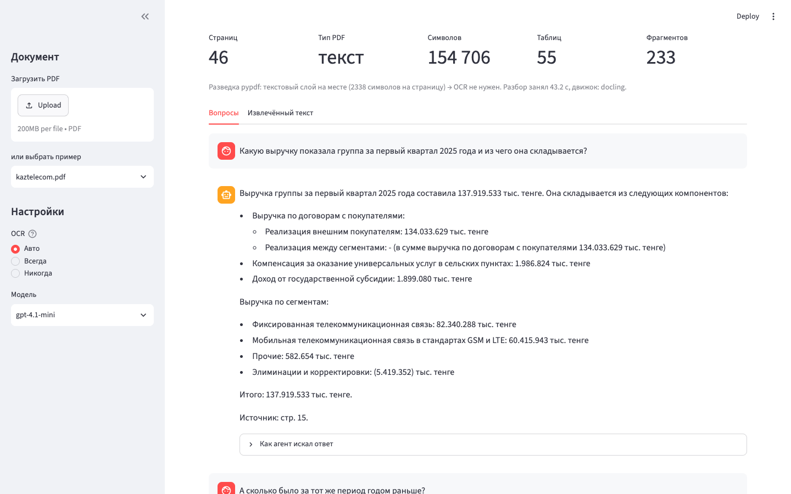

# QA-агент по PDF

Агент отвечает на вопросы по содержимому PDF-документа: эссе, научной статьи, отчёта.
Сам определяет, что за файл перед ним, и выбирает способ извлечения — от этого зависит,
получится ли вообще что-то прочитать.

Бонусное задание 5 лабораторной 09 (nFactorial School, LLM Engineer) — «PDF Parsing & OCR».



## Что умеет

| Требование задания | Как сделано |
|---|---|
| Извлекать текст **и структуру** | Docling: заголовки, абзацы и таблицы попадают в Markdown, таблицы остаются таблицами |
| Обрабатывать документы разного качества | pypdf «прощупывает» файл; нет текстового слоя — включается OCR (Vision framework macOS) |
| Осмысленно отвечать на вопросы | Агент LangChain с тремя инструментами и ссылками на страницы-источники |

## Как это устроено

```
PDF ──> probe (pypdf)            сколько текста отдаёт документ?
         │
         ├── > 100 симв./стр. ──> Docling без OCR          (быстро, структура и таблицы)
         └── ≈ 0 симв./стр.  ──> Docling + OCR (ocrmac)     (скан)
                                     │
                                     v
                        постраничный Markdown ──> чанки (1200/200, метаданные страниц)
                                     │
                                     v
                        InMemoryVectorStore + OpenAI embeddings
                                     │
                                     v
                        агент LangChain (create_agent), инструменты:
                          · search_document(query) — поиск по смыслу
                          · read_page(page)        — страница целиком, для таблиц
                          · document_outline()     — оглавление
```

Почему именно так:

* **Разведка перед разбором.** OCR на 46-страничном текстовом отчёте — это минуты ожидания
  без выигрыша в качестве. Один дешёвый проход pypdf отвечает на вопрос, нужен ли он вообще.
* **Docling, а не голый pypdf.** pypdf возвращает плоский текст: непонятно, какое число
  к какой строке таблицы относится. Docling сохраняет структуру — и ответы по финансовым
  таблицам перестают быть угадыванием.
* **Агент, а не одна RAG-цепочка.** По таблице семантический поиск часто приносит обрывок;
  агент это видит и дочитывает страницу целиком через `read_page`. На скриншотах видно, как он
  сначала ищет, потом открывает страницу 15 и 16.
* **Кэш разобранного документа** в `.cache/` — повторный запуск не платит за OCR второй раз.

## Запуск

```bash
python -m venv .venv && source .venv/bin/activate
pip install -r requirements.txt

cp .env.example .env        # и вписать OPENAI_API_KEY
```

Веб-интерфейс:

```bash
streamlit run app.py
```

Консоль:

```bash
python cli.py документ.pdf "Какая выручка за первый квартал?"
python cli.py скан.pdf --ocr "О чём этот текст?"
python cli.py документ.pdf                 # интерактивный режим
```

Пример консольного вывода — в [docs/demo-cli.md](docs/demo-cli.md).

**Про OCR.** Используется `ocrmac` — нативный Vision framework macOS: не нужны ни внешние
бинарники, ни тяжёлые модели. На другой ОС поменяйте `OcrMacOptions` в
[pdf_qa/extract.py](pdf_qa/extract.py) на `RapidOcrOptions` или `TesseractOcrOptions` —
остальной код не изменится.

## Что на скриншотах

| | |
|---|---|
| [01](docs/screenshots/01-start.png) | стартовый экран |
| [02](docs/screenshots/02-loaded-text-pdf.png) | текстовый PDF разобран: 46 страниц, 55 таблиц, OCR не понадобился |
| [03](docs/screenshots/03-answer-text-pdf.png) | ответ с разбивкой выручки по сегментам и ссылкой на страницу |
| [04](docs/screenshots/04-followup-and-tool-calls.png) | уточняющий вопрос «а годом раньше?» и вызовы инструментов |
| [05](docs/screenshots/05-extracted-structure.png) | извлечённая структура: заголовки, списки |
| [06](docs/screenshots/06-extracted-table.png) | таблица отчётности осталась таблицей |
| [07](docs/screenshots/07-answer-scanned-ocr.png) | скан: текстового слоя нет, включился OCR — и ответ по нему |
| [08](docs/screenshots/08-no-answer-in-document.png) | вопрос не по документу: агент не выдумывает |
| [09](docs/screenshots/09-ocr-text-of-scan.png) | текст, распознанный со скана |

## Структура

```
pdf_qa/extract.py   определение типа PDF, Docling/OCR, кэш
pdf_qa/index.py     разрезание на чанки и векторный индекс
pdf_qa/agent.py     инструменты и агент LangChain
app.py              веб-интерфейс Streamlit
cli.py              консольный запуск
```

## Ограничения

* Графики и диаграммы агент не «видит» — для них нужна VL-модель (это задание 4 лабораторной).
* Индекс живёт в памяти процесса: перезапуск — и эмбеддинги считаются заново
  (сам разобранный текст при этом берётся из кэша).
* Качество OCR на рукописных и низкоконтрастных сканах заметно ниже, чем на печатных.
